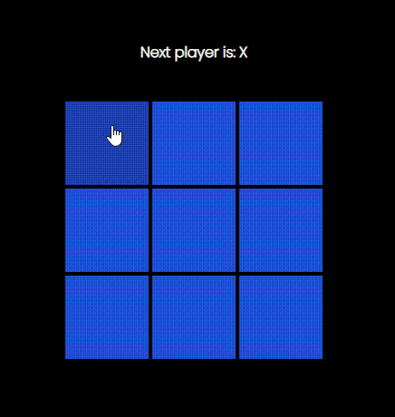

# React + Vite + TailwindCSS

This template provides a minimal setup to get React working in Vite with HMR and some ESLint rules.

This project was my old practice project when I started learning ReactJS in the year 2022. On March 12, it was designed using the CSS framework called Tailwind CSS

<h3>Demo</h3>

